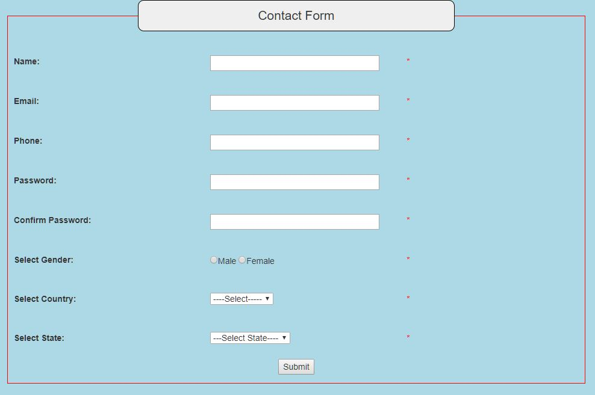

# Responsive-Form-Validation-using-PHP
This is a representation of a form that validates details that are being entered. It will check your password and other details that you have entered and return an error if there is any, i.e, if the details that you are entering do not meet the requirements or are incorrect.
The code has been uploaded in the file html_code.

